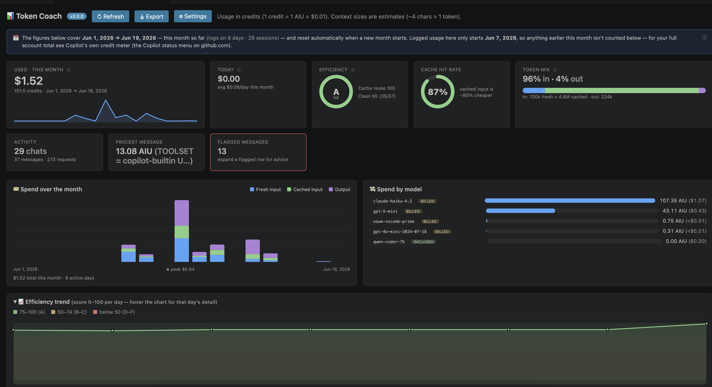

<p align="center">
  
</p>

<h1 align="center">Token Coach</h1>

<p align="center">
  Read <b>GitHub Copilot's</b> local debug logs, see your real token <b>cost</b> &amp;
  <b>cache efficiency</b>, and get coached toward cheaper usage —<br/>
  strictly <b>read-only</b>, with no network calls.
</p>

<p align="center">
  <a href="LICENSE"></a>
  <a href="https://marketplace.visualstudio.com/items?itemName=NadavLAN.token-coach"></a>
</p>



> 📘 See **[GUIDE.md](GUIDE.md)** for what we built & how it works, plus detailed
> **local-install** and **publishing** instructions.

## Why cost, not tokens?

The real cost metric is **`copilotUsageNanoAiu`**, *not* raw token counts. The
big lever is caching: `cachedTokens` dramatically reduce cost. In real data, two
~29K-input requests cost **3.78 AIU vs 0.66 AIU** — an **83% difference purely
from caching**.

So this tool surfaces:

- **Cost** in AIU (`1 AIU = 1,000,000,000 NanoAiu`),
- **Cache hit rate** (`cachedTokens / inputTokens`), and
- **Coaching warnings** that flag expensive requests and low cache utilization.

## Features

- **Chart-driven dashboard** — a dense KPI grid (efficiency & cache **rings**, an
  interactive daily-spend **sparkline**), a **spend-over-the-month** stacked-column
  chart (fresh / cached / output, with the spike days obvious), **spend-by-model**
  ranked bars, a token-mix **donut**, and an **interactive efficiency-trend** line
  chart with a crosshair + tooltip that follows the mouse. All hand-built **inline
  SVG** — zero dependencies, themed to VS Code's chart palette, and fully inside the
  webview's strict CSP.
- **One-click onboarding** — if Copilot debug logging is off, the dashboard shows an
  **⚡ Enable Copilot logging** button that flips the two settings for you; a **⚙
  Settings** button is one click away in the toolbar.
- **Log parser** — finds every `main.jsonl` under VS Code's `workspaceStorage`
  (cross-platform), parses it line-by-line, and tolerates malformed lines.
- **Rules engine** — flags expensive requests, low cache hits on large inputs,
  oversized inputs, and huge-input/tiny-output requests. All thresholds are
  configurable.
- **Status bar** — shows **today's** cost (credits used since local midnight) —
  a small, honest window that doesn't try to mirror Copilot's own monthly credit
  meter. Hover for a today / all-time-logged breakdown, click to open the
  dashboard.
- **Dashboard, grouped by month → day → chat → message** — the chat list is
  grouped by month (this month expanded, older months collapse to a header you
  click to open) and by day within each month; nothing is dropped when a new
  month starts. The chat level is each **chat**
  (one Copilot conversation / debug session), labelled with its generated title
  (e.g. "Basic React app template") or the first message, and rolled up to its
  own cost, tokens, cache rate, message/request/tool counts and models.
  Everything starts collapsed; click a chat to reveal its messages, where
  **one row = one message you asked**. Agent mode
  fans a single message out into many requests across several turns (and
  sometimes several models, e.g. a cheap `gpt-4o-mini` for side-tasks alongside
  the main model), so each row rolls those up into a summary: total cost,
  tokens, cache hit rate, and which models were used. Warning rows are
  highlighted. Expand a message to see:
  - **Where the tokens went** — the cost drivers. A **tools** table (calls,
    total time, payload injected) surfaces tools "taking too much" (e.g. lots of
    `read_file`/`create_file`), and a **context** breakdown shows where the
    prompt came from — the **system prompt** and **tool definitions** (read from
    the `system_prompt_*.json` / `tools_*.json` sidecar files Copilot writes
    next to the log; these are fixed per request and usually cached, and the
    tool schemas are often the single largest chunk), plus **attachments / open
    editors** (with the actual file names and sizes), workspace structure,
    memory, environment/terminal context, etc. Hover any source for an
    explanation.
  - **Turn-by-turn** — the main request of each turn with its tool calls nested
    underneath ("the main one, and then inside").

  The editor tab title shows the live totals (e.g. `Token Coach · 14.67 AIU ·
  524k tok`), and expanded rows + scroll position are preserved across the live
  refreshes.
- **Dollars** — AIU is converted to USD (1 AIU ≈ $0.01) and shown alongside the
  raw cost (credits). Token Coach shows **what you've actually used** from the
  local logs — no quota or plan denominator, and it deliberately doesn't try to
  reproduce Copilot's monthly credit total (the local chat/agent logs only ever
  capture a fraction of it; Copilot's own status menu is the source of truth for
  that). See [Cost in dollars](#cost-in-dollars-credits).

  > Note on context sizes: Copilot only itemizes the in-prompt context blocks on
  > the first turn (attachments, workspace, memory, …); later turns log just the
  > delta. The system prompt and tool schemas come from sidecar files. All sizes
  > are therefore **estimates** (~4 chars ≈ 1 token) shown as a share of the
  > breakdown, which is close to — but not exactly — the model's input token
  > count.
- **Live updates** — a file watcher (plus a backup poll) re-parses logs when
  Copilot writes new entries, and notifies you when a new request is expensive.

### Efficiency & spend insights

Higher-level views layered on top of the raw cost data:

- **Efficiency grade (A–F)** — one glanceable health score = 60% cache reuse +
  40% "clean runs" (messages with no real warning). Shown in the status bar
  (which also tints **yellow/red** when efficiency is poor or you near/exceed your
  plan budget), as a dashboard card, and as a **per-chat grade badge**.
- **Model spend** — a per-model table of requests / tokens / cost, tagged
  **billed** vs **included**, so you see where premium budget goes. A
  `premium-overkill` coaching note flags small, billed turns a base (included)
  model could have handled for free.
- **Tool overhead (structural waste)** — parses the tool catalog Copilot ships on
  every request and lists tools **defined but never called** — dead weight in your
  cached prefix, the Copilot analog of "skills you installed but never invoke".
- **"Tools you might not need" banner** — a top-of-dashboard call-out for tools
  that stay unused *across chats*, so you can consider disabling the MCP server or
  tool set they come from. It uses a **net counter** (`+1` for each chat a tool was
  offered but never called, `−1` for each chat it *was* used, floored at `0`) and
  flags a tool once it reaches `tokenCoach.unusedToolMinChats` (default `3`). Use
  the tool again and its score falls until it drops off the list — so the advice
  self-corrects. Framed honestly as "unused in your logged chats", not "safe to
  delete".
- **Idle cache-expiry detection** — flags when a mid-chat message arrived after a
  pause longer than the prompt-cache TTL (~5 min) *and* its cache reuse actually
  dropped — i.e. the cache went cold from time alone, re-billing the whole context
  at the full input rate. Shown as a **⏱ idle** chip on the message, a
  `cache-expired-idle` warning (so it counts in the grade), and a real-time nudge.
- **Proactive nudges** — a gentle, throttled notification (≤1 per 5 min) when a
  new message shows an actionable inefficiency (cache went cold from idle/size, or
  open files dominate context).
- **Save / export** — *Token Coach: Export Report* writes a Markdown snapshot
  (summary, efficiency, model spend, unused tools, top chats, trend) you can keep;
  the extension also records a **daily efficiency trend** shown on the dashboard.
- **Local logs only — nothing leaves your machine** — every figure comes
  straight from the Copilot debug logs on this machine. Those logs are a
  *partial* record (other machines/workspaces, and ask/inline non-agent modes,
  aren't written here), so the total normally reads lower than your account-wide
  meter. Token Coach makes **no network calls** and reads no account/billing data
  — for your real monthly total, see Copilot's own credit meter on github.com.

## 1. Enable Copilot debug logging

The extension can only show data if Copilot is writing logs. In VS Code settings
(`Cmd/Ctrl+,`), set **both** of these to `true`:

```jsonc
"github.copilot.chat.agentDebugLog.enabled": true,
"github.copilot.chat.agentDebugLog.fileLogging.enabled": true
```

Copilot then writes logs to:

| OS | Path |
| --- | --- |
| macOS | `~/Library/Application Support/Code/User/workspaceStorage/<hash>/GitHub.copilot-chat/debug-logs/<session>/main.jsonl` |
| Windows | `%APPDATA%\Code\User\workspaceStorage\<hash>\GitHub.copilot-chat\debug-logs\<session>\main.jsonl` |
| Linux | `~/.config/Code/User/workspaceStorage/<hash>/GitHub.copilot-chat/debug-logs/<session>/main.jsonl` |

**Works on any computer — no path configuration needed.** The extension finds
this folder automatically: it derives it from VS Code's *own* storage location
(`context.globalStorageUri`), which is correct for every install — standard,
**portable mode**, a custom `--user-data-dir`, **Insiders**, **VSCodium**, etc.
The standard per-OS locations above are also scanned as a fallback. If yours is
somewhere truly non-standard, set `tokenCoach.workspaceStoragePathOverride` to
point at your `workspaceStorage` directory.

> Note: the extension reads logs on the machine/host where it runs. In a Remote
> SSH / WSL / Dev Container / Codespaces window, install it in that same remote
> so it sees the remote logs.

## 2. Build

```bash
npm install
npm run compile
```

Use `npm run watch` to recompile on save while developing.

## 3. Run in the Extension Development Host

1. Open this folder in VS Code.
2. Press **F5** (runs the `Run Extension` launch config, which compiles first).
3. A new **Extension Development Host** window opens with the extension loaded.
4. In that window, make sure the two Copilot debug settings above are enabled,
   then use Copilot Chat a few times.
5. Click the status bar item (or run **“Token Coach: Show Dashboard”**
   from the Command Palette) to open the dashboard.

## 4. Package to a `.vsix`

```bash
npm install -g @vscode/vsce   # if you don't have it
npm run package               # runs `vsce package`
```

This produces `token-coach-2.0.0.vsix`, which you can install with
**Extensions: Install from VSIX…** or:

```bash
code --install-extension token-coach-2.0.0.vsix
```

## Settings

Every threshold below is a regular VS Code setting — edit it in the Settings UI
(run **“Token Coach: Open Settings”** from the Command Palette to jump straight to
them), or in your `settings.json`. Nothing is hard-coded.

| Setting | Default | Meaning |
| --- | --- | --- |
| `tokenCoach.costWarnThreshold` | `3` | Flag a request that costs more than this many **credits** (1 credit = 1 AIU = $0.01). |
| `tokenCoach.inputWarnThreshold` | `50000` | Flag `inputTokens` above this. |
| `tokenCoach.lowCacheRateThreshold` | `0.5` | Cache hit rate below this is "low". |
| `tokenCoach.lowCacheMinInputTokens` | `20000` | Minimum input before the low-cache rule fires. |
| `tokenCoach.ioRatioThreshold` | `1000` | Flag `inputTokens/outputTokens` above this. |
| `tokenCoach.ioMinInputTokens` | `10000` | Minimum input before the tiny-output rule fires, so small side-calls aren't mislabelled "huge input". |
| `tokenCoach.attachmentShareWarn` | `0.4` | Flag a message when open/attached files exceed this share of its logged context. |
| `tokenCoach.slowToolWarnMs` | `10000` | Flag a message when one tool consumes more than this many ms (summed across calls). |
| `tokenCoach.unusedToolMinChats` | `3` | Net "unused across chats" score a tool must reach before the dashboard flags it as a candidate to disable (`+1` per chat offered-but-unused, `−1` per chat used, floored at `0`). |
| `tokenCoach.cacheIdleMinutes` | `5` | Idle minutes after which the prompt cache is assumed expired (Claude TTL ~5 min, OpenAI ~5–10 min). A mid-chat message after a longer pause whose cache reuse also dropped is flagged `cache-expired-idle`. `0` disables. |
| `tokenCoach.usdPerAiu` | `0.01` | US dollars per 1 AIU (1 AI credit = $0.01, 1 AIU ≈ 1 credit). Set `0` to hide dollar figures. |
| `tokenCoach.planMonthlyUsd` | `19` | Your monthly plan price (Business = $19, Enterprise/Pro+ = $39). Only tints the status bar when spend gets large — no quota is shown. |
| `tokenCoach.notifyOnExpensiveRequest` | `true` | Notify when a new request exceeds the cost threshold. |
| `tokenCoach.notifyOnInefficiency` | `true` | Gentle, throttled nudge (≤1 / 5 min) on a new message's actionable inefficiency (cache cold mid-chat, heavy attachments). |
| `tokenCoach.pollIntervalSeconds` | `20` | Backup poll interval; `0` disables polling. |

> For a non-standard install, you can still point the scanner at an explicit
> `workspaceStorage` directory by setting `tokenCoach.workspaceStoragePathOverride`
> in your `settings.json` (it's no longer shown in the Settings UI).

## Cost in dollars (credits)

As of **June 1, 2026**, GitHub Copilot moved to usage-based billing: **1 GitHub AI
credit = $0.01**, and each plan includes a monthly dollar allowance of credits
(**Business = $19**, **Enterprise / Pro+ = $39**). Empirically, **1 AIU ≈ 1 AI
credit ≈ $0.01** — e.g. a 0.66 AIU Haiku request (mostly cached input) works out
to ≈ $0.0065 at real model rates, matching `0.66 × $0.01`.

So the dashboard leads with **how much you've used** — credits and dollars — over the
**logged period**, with a banner stating the window your debug logs actually span
(e.g. *"Jun 7 → Jun 8, 2026 · 2 days · 6 sessions"*). The figure is usage in that
window only; no quota or plan denominator is shown.

### Why the dashboard reads lower than GitHub's meter

Token Coach sums `copilotUsageNanoAiu` from Copilot's **local debug logs**, and each
request's cost is exact — a gpt-5-mini turn with 10,642 new + 12,800 cached input +
1,681 output computes to `0.63425` credits at GitHub's published rates
(`$0.25 / $0.025 / $2.00` per 1M), which is what the log records, to the cent.

But the logs are only a **partial record** of your month, so the total is lower than
GitHub's meter:

- **This machine only** — other devices, IDEs, and github.com/CLI usage aren't here.
- **Agent debug log only** — ask/edit/inline Copilot Chat also spend credits but
  aren't written to `agentDebugLog`.
- **Only since you enabled logging**, only for workspaces you used it in, and logs
  are **pruned by rotation** over time.

This gap can't be fixed by reading the logs differently — the missing usage simply
isn't on disk. (Tell-tale sign: the gap is a *different* ratio on each machine —
e.g. `1.64×` on one, `1.99×` on another — so it's missing data, not a constant
conversion error.) Token Coach deliberately makes **no network calls** and reads
nothing from your GitHub account — it only ever reports what's in the local logs.
To see your **real** account-wide monthly total, use Copilot's own credit meter
(the Copilot status menu on github.com).

Sources: [GitHub Copilot is moving to usage-based billing](https://github.blog/news-insights/company-news/github-copilot-is-moving-to-usage-based-billing/) ·
[Models and pricing for GitHub Copilot](https://docs.github.com/en/copilot/reference/copilot-billing/models-and-pricing) ·
[Plans for GitHub Copilot](https://docs.github.com/en/copilot/get-started/plans)

## Coaching rules

| Rule | Condition | Advice |
| --- | --- | --- |
| Expensive request | `cost > costWarnThreshold` | Split the task into smaller, focused steps. |
| Cold start (info) | first message of a chat with low aggregate cache | None needed — the cache is cold on the first message; staying in the chat reuses it next turn. |
| Cache expired (idle) | a **later** message that arrived after a gap ≥ `cacheIdleMinutes` **and** whose cache reuse actually dropped | The prompt cache (TTL ~5 min, sliding) expired during the pause, so the whole context was re-billed at the full input rate. Keep a thread warm (next message within ~5 min) or batch related questions. |
| Low cache hit | a **later** message (not the first) with large input and low cache, **not** explained by idle time | The chat likely outgrew the cache window or its context changed; for a new task, a fresh focused chat can be cheaper. |
| Large input | `inputTokens > inputWarnThreshold` | Close irrelevant files/tabs to shrink context. |
| Tiny output | `inputTokens > ioMinInputTokens` **and** `inputTokens / outputTokens > ioRatioThreshold` | Reconsider whether agent mode / full context was needed. |
| Heavy attachments | attachments > `attachmentShareWarn` of logged context | Close unused editors/tabs — open files are bloating context. |
| Slow tool | one tool's total time > `slowToolWarnMs` | Heavy tool use lengthens turns and grows context. |
| Premium overkill (info) | a small (`<8K` input), tool-free, single-turn message that was **billed** (`cost > 0`) | A base model (GPT-4.1 / GPT-4o, included in your plan) would likely have done it for free — use the model picker for quick edits & questions. |

## Project structure

```
token-coach/
├── package.json      # manifest: commands, settings, activation
├── tsconfig.json
├── src/
│   ├── extension.ts     # activate/deactivate, status bar, watcher, commands, history
│   ├── logParser.ts     # find + parse jsonl, tool inventory
│   ├── coach.ts         # rules engine
│   ├── efficiency.ts    # A–F efficiency grade (all-time + per-chat)
│   ├── dashboard.ts     # webview HTML + update logic
│   └── report.ts        # Markdown export + daily-trend snapshot type
└── README.md
```

## Acceptance test

With Copilot debug logging enabled, use Copilot Chat a few times, then open the
dashboard. It should list real requests with cost and cache hit rate, and
highlight any expensive ones.

## License

[Apache License 2.0](LICENSE) © 2026 Nadav Landesman — free for personal and
commercial use, with a patent grant.
